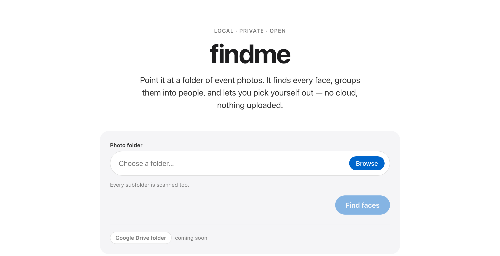
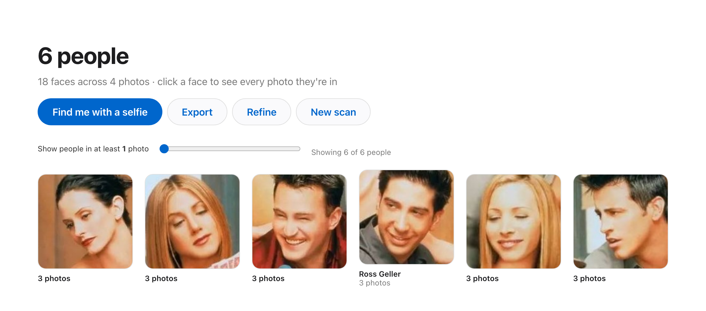
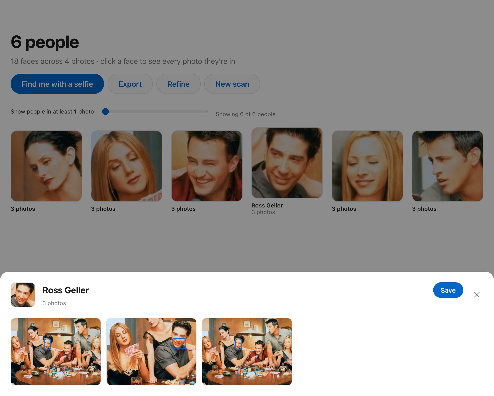
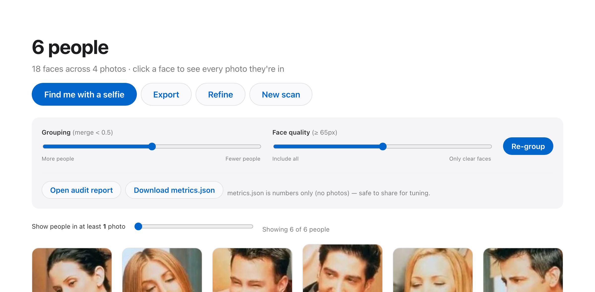
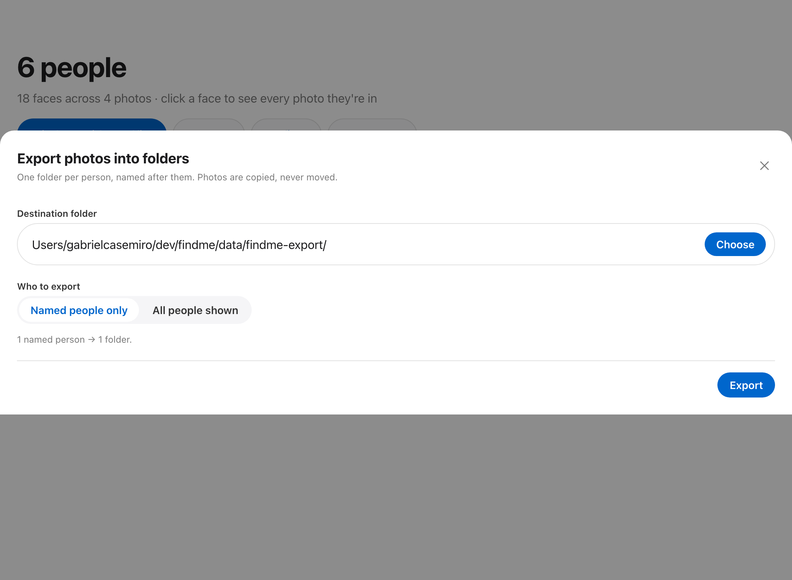

# findme

**Find yourself in the pile.** Point `findme` at a folder of event photos — a photoshoot,
a marathon, a party with a thousand shots — and it detects every face, groups them into
*people*, and lets you pick yourself out. Optionally drop in a selfie and the most likely
"you" floats to the top.

Everything runs **locally on your machine**. No cloud, no account, nothing uploaded. Your
photos never leave your computer, and no face data is ever stored anywhere but your own disk.

## Screenshots

Point it at a folder — nothing is uploaded.



Every face, grouped into people and sorted by how often they appear; the slider hides the
crowd tail so the main subjects surface first.



One person → every photo they're in, with their face boxed. Name them right here.



**Refine** re-groups instantly (quality + grouping sliders, reusing cached embeddings) and
exports a numbers-only audit report.



**Export** copies each person's photos into a folder named after them.



<sub>Demo images are the InsightFace sample photo (the cast of *Friends*); no real event
photos are included in this repository.</sub>

## Why

Getting back a shared folder with 1,200 photos and having to eyeball every one to find the
14 you're in is miserable — and it's the same story for running events, weddings, and
conferences. The paid tools that solve this are all cloud SaaS that ingest and store
everyone's biometric data. `findme` is the opposite: **local, private, open**.

## Quickstart

Requires [`uv`](https://docs.astral.sh/uv/) and a C compiler (Xcode Command Line Tools on
macOS: `xcode-select --install`).

```bash
./setup.sh      # one-time: creates .venv (Python 3.12) and installs everything
./run.sh        # starts the server at http://127.0.0.1:8000
```

Open <http://127.0.0.1:8000>, paste the **full path** to a folder of photos, and click
**Find faces**. The first scan downloads the face model (~300 MB) once.

A small sample scan (the bundled test set) already appears under **Recent scans** so you can
click straight into results without scanning anything.

## How it works

```
photos ─▶ detect faces ─▶ embed each face ─▶ cluster embeddings ─▶ people
 (InsightFace buffalo_l / ArcFace, CPU)      (agglomerative, cosine)

selfie ─▶ embed ─▶ cosine-rank every cluster ─▶ "most likely you"
```

- **Detection + recognition:** [InsightFace](https://github.com/deepinsight/insightface)
  `buffalo_l` (ArcFace). Each face becomes an L2-normalized 512-d embedding.
- **Clustering:** average-linkage agglomerative clustering with a cosine cutoff
  (`CLUSTER_DISTANCE` in `app/config.py`). Faces closer than the cutoff are the same person;
  anyone matched to no one else becomes their own group.
- **Selfie match:** the selfie's embedding is scored against every cluster (mean of its top
  few cosine similarities) and the people are re-ordered by resemblance.
- **Storage:** per scan, face crops + photo thumbnails + an embeddings array + `index.json`
  are written under `data/jobs/<id>/` (all gitignored). Delete `data/` to wipe everything.

## Naming people & exporting to folders

- **Name a person:** click their face → type a name in the sheet → **Save**. The name shows
  on their card. Names are **anchored to the face**, so they survive a re-group (the name
  follows that person into whatever cluster they land in).
- **Export → folders:** the **Export** button copies each person's photos into
  `destination/<name>/` — one folder per person, named after them (unnamed people become
  `pessoa_N`). A photo with several people is copied into each of their folders; originals
  are never moved. Choose to export **named people only** or **all people shown** (respecting
  the "at least N photos" filter). Typical flow: name the ~20 people you care about → Export
  named only → done.

## Tuning the results (Refine panel)

Clustering a busy event is never perfect on the first pass — blurry, side-on, or tiny
faces are ambiguous. `findme` handles this in two ways:

- **Quality-aware grouping.** Only confident, big-enough faces ("anchors") define each
  person. A near-duplicate-centroid merge pass heals a person split into fragments. Every
  remaining weak face is attached to a person *only if* it's clearly closest (a margin over
  the runner-up); otherwise it goes to the **Unsorted** pile instead of joining the wrong
  person.
- **Live controls (no re-scan).** The **Refine** panel re-groups from cached embeddings in
  seconds:
  - **Grouping** — stricter (more, tighter people) ↔ looser (fewer, merged people).
  - **Face quality** — include every face ↔ only clear faces (weaker ones become Unsorted).
  - The **"Show people in at least N photos"** slider hides the long audience tail so the
    main subjects surface first (at a typical event the top ~20 by photo count *are* the
    participants).

## Auditing & sharing results

Two exports (in the Refine panel), designed to keep faces on your machine:

- **Open audit report** → writes a self-contained `report.html` (face montage per person)
  into the job folder and opens it locally. Great for eyeballing mistakes.
- **Download metrics.json** → **numbers only, no images** (per-cluster tightness, nearest
  other person, and the faces sitting farthest from their own group = likely mis-merges).
  Safe to share for tuning.

Because `findme` runs locally, an assistant with access to this machine can audit by
reading `data/jobs/<id>/metrics.json` and `report.html` directly — no need to upload
anyone's face to a cloud service.

## Project layout

```
app/
  engine.py     InsightFace wrapper — load image, detect faces, embed, crop
  pipeline.py   scan a folder end to end (runs in a background thread)
  cluster.py    quality-aware grouping (anchors → merge → margin-assign); selfie ranking
  store.py      job state + on-disk persistence
  main.py       FastAPI routes + static serving
  config.py     paths and tunables
web/            single-page UI (vanilla HTML/CSS/JS, Apple-style design tokens)
```

## Design

The UI follows an Apple-inspired design language (adapted from
[`rukkiecodes/claude-apple-design-system`](https://github.com/rukkiecodes/claude-apple-design-system)):
one Action-Blue accent, pill CTAs, no chrome shadows (depth comes from surface color +
hairlines), a 400/600/700 weight ladder, continuous corners, and lots of air. Tokens live as
CSS custom properties at the top of `web/styles.css`.

## Roadmap

- **Google Drive folders** — paste a shared Drive link; stream photos, embed, discard
  originals (never stored). This keeps the privacy model intact for photos you didn't download.
- Merge / split people, and name a person.
- Video frames (sample frames from clips).
- GPU acceleration for large libraries (10k+ photos).

## A note on privacy & the law

Face embeddings are **biometric data**, which is regulated (Illinois BIPA, EU GDPR, Brazil
LGPD). `findme` is designed to stay on the safe side by construction: it runs entirely on
your machine, stores nothing off-device, and only ever processes a selfie *you* voluntarily
provide. If you ever host this for others, you become the data controller — add clear consent
and a retention/deletion policy first.

## License

MIT.
